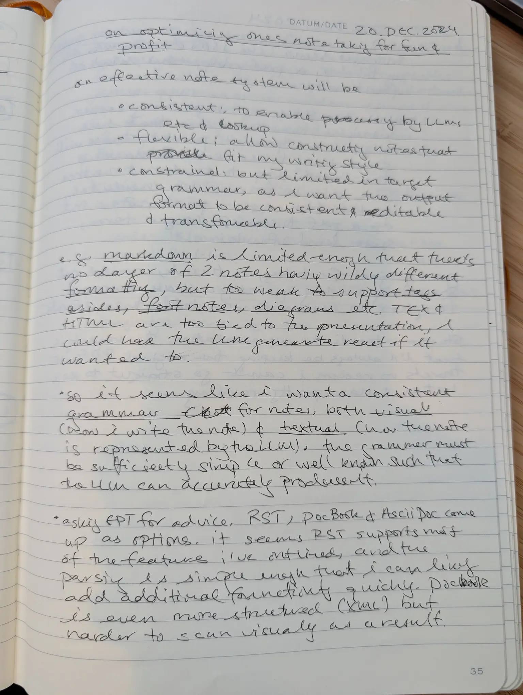
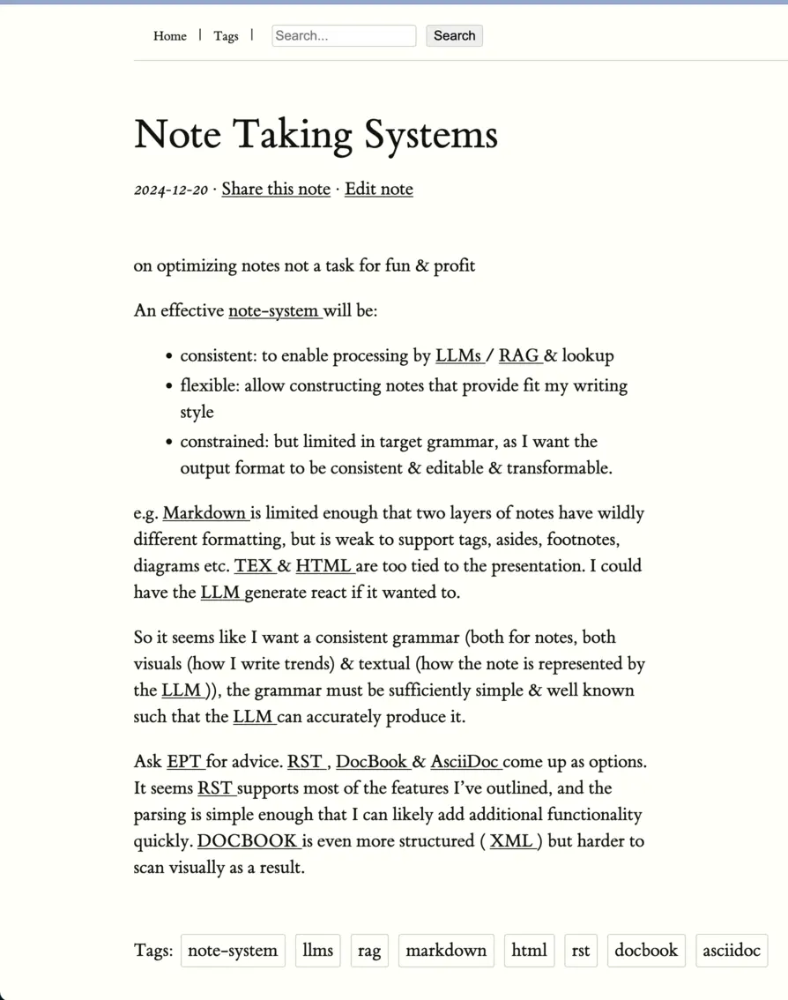

# NoteOMatic: From Handwriting to Digital Notes

Transform your handwritten notes into searchable digital content with ease.




In addition to the transcription and rendering of your (if like mine) terrible
handwriting, you also get automatic tagging, hyperlinking, a nice note index and
more!

# Installation

Install UV:

```
curl -LsSf https://astral.sh/uv/install.sh | sh
```

# Configuration

Configuration is managed by Pydantic-Settings; you can use either a .env file or
environment variables to adjust the configuration. By default you'll only need a
Gemini API key to load notes:

```
export NOTEOMATIC_GEMINI_API_KEY=...
```

# Running the demo server

```
uv run flask --app noteomatic.demo.app:app run --port=8000 [--host=...]
```

# Importing Notes

You can import notes via the web interace (click the upload link), or via the
command line using the `extract` command.

```
uv run scripts/manage.py submit --source=path/to/pdf_or_glob
```
