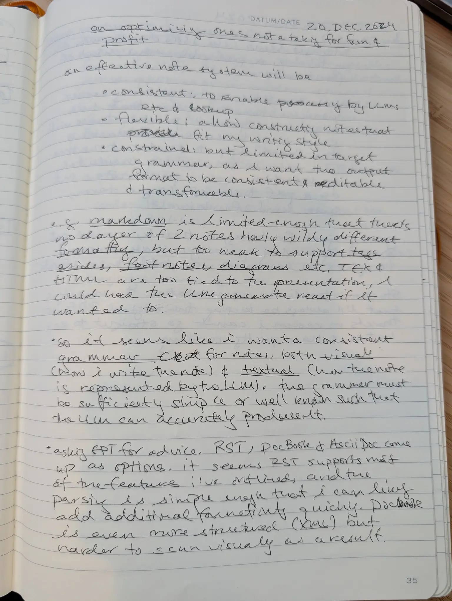
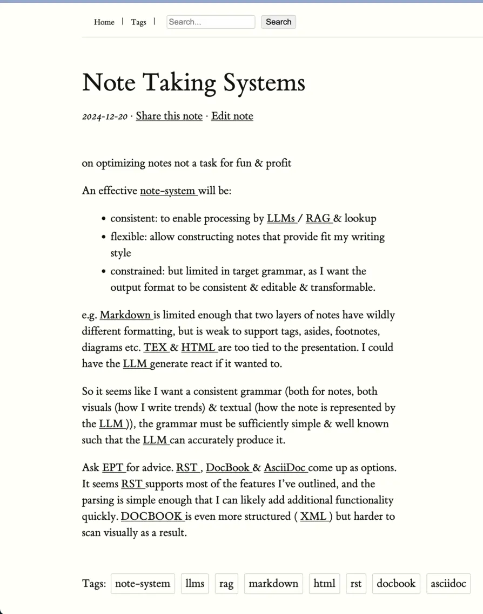

# NoteOMatic: From Handwriting to Digital Notes

Transform your handwritten notes into searchable digital content with ease.




In addition to the transcription and rendering of your (if like mine) terrible
handwriting, you also get automatic tagging, hyperlinking, a nice note index and
more!

# Installation

Install UV:

```
curl -LsSf https://astral.sh/uv/install.sh | sh
```

# Configuration

Configuration is managed by Pydantic-Settings in `src/noteomatic/config.py`. You can use either a .env file or
environment variables to adjust the configuration. The required environment variables are:

```
# Required API keys and secrets
export NOTEOMATIC_GEMINI_API_KEY=...        # Google Gemini API key for AI features
export NOTEOMATIC_GOOGLE_CLIENT_ID=...      # Google OAuth client ID for login
export NOTEOMATIC_GOOGLE_CLIENT_SECRET=...  # Google OAuth client secret for login

# Optional settings
export NOTEOMATIC_GOOGLE_OAUTH_REDIRECT_URI=http://localhost:5000/login/callback
export NOTEOMATIC_DEBUG=true                # Enable debug mode
export NOTEOMATIC_LOG_LEVEL=DEBUG           # Set logging level
```

The application will check for these required keys at startup and provide clear error messages if any are missing.

# Running the server

```
uv run flask --app noteomatic.app:app run --port=8000 [--host=...]
```

# Importing Notes

You can import notes via the web interace (just click the upload link), by
syncing with a Google Drive file (you'll need to setup your own application and
OAuth credentials for this), or via the command line.

## Sync with Google Drive

You can sync with a Google Drive folder using the `sync` command. You'll need to
create a Google OAuth credential with Google Drive access, and put the client
secrets into `credentials/client_secret.json`:

https://console.cloud.google.com/auth/scopes

```
uv run scripts/manage.py sync
```

## Syncing files on disk

Alternatively, you can load new notes on the command line using the submit command:

```
uv run scripts/manage.py submit --source=path/to/pdf_or_glob
```
